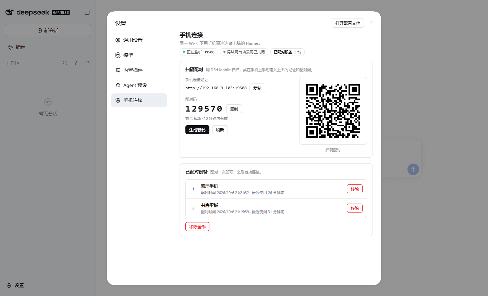

# dsh-mobile-connect

**让手机在同一个 Wi-Fi 下直接连上这台电脑的 DeepSeek Harness。** 扫码配对，不用端口转发，不用改网络设置。

---

## 它解决什么问题

`dsh web` 只监听本机（`127.0.0.1`），并且会主动拒绝 `--host 0.0.0.0`——这是对的，把「能执行任意代码的接口」直接暴露到网络上不该是默认行为。

但这留下一个空档：**你想用自己的手机连自己的电脑，却没有一条干净的路。** 手工做端口转发既麻烦，又是完全没有认证的——同一个 Wi-Fi 下任何人都能用。

这个插件就是那条干净的路：一个带配对的局域网网关。

---

## 装上之后是什么样

启动 `dsh web` 时，终端里会多出这样一块：

```
┌─ DSH Mobile Connect ───────────────────────────────────────┐
│ 手机连接地址  http://192.168.1.5:19387                     │
│ 配对码        021088                                       │
│ 有效期        10 分钟                                      │
├────────────────────────────────────────────────────────────┤
│ 用 DSH Mobile 扫描下面的二维码，或手动输入上面的地址，     │
│ 然后填入配对码。配对一次即可，之后自动连接。               │
└────────────────────────────────────────────────────────────┘

  █▀▀▀▀▀█  ▀▄ ████▄█ █▄▄▀█▀ █▀▀▀▀▀█
  █ ███ █ █▀ ▄▀▄█▄ ▀█▄▄▄▀█  █ ███ █
  ...
```

手机上：打开 DSH Mobile → 设置 → **搜索电脑** → 点一下找到的电脑 → 输入 6 位配对码 → 连接。

**配对一次就够了。** 之后每次打开应用自动连上，不用再输。

> **配对码会过期。** 上面这块面板只在启动时打印一次，而配对码默认 10 分钟后失效
> （或配对成功一台手机后就作废）。**面板里显示的码不是永久有效的**：需要给第二台手机
> 配对、或过了一阵子再来配对时，请点桌面界面里的「生成新码」，或在会话里运行 `/connect`。

---

## 桌面界面

终端里那块面板只在启动时打印一次，而且配对码会过期。所以插件在桌面版里还有一块界面：
**设置 → 手机连接**。



它把终端面板里的东西做成可操作的：

- **手机连接地址** —— 就是手机要打开的那个地址，旁边一个「复制」。
- **配对码** —— 大号数字，带 `剩余 6:26` 倒计时。倒计时在本地按绝对过期时间算，
  所以它是准的，而不是每次轮询都把余量四舍五入一遍。
- **二维码** —— 由插件后端渲染成 SVG（不是浏览器里再写一个编码器：`qr.js` 的矩阵是
  逐模块对照参考实现验证过的，GUI 用同一个）。
- **已配对设备** —— 每台设备显示名称、配对时间和最近使用时间，各自带一个「移除」。
- **生成新码 / 刷新 / 移除全部** —— 生成新码会立刻作废旧码；移除需要再确认一次。

几个刻意的设计：

**只读的读取不会重新生成配对码。** 面板每 15 秒轮询一次 `/status`，而那条路由用的是
`peekCode()` 而不是 `currentCode()`。差别很关键：`currentCode()` 在码过期时会悄悄补一个新的，
对「用户问我现在是什么码」是对的，对一个轮询的界面就是灾难 —— 你正在输入的那个码会在
你输完之前被换掉，屏幕上永远显示一个不能用的码。

**界面先挂载，再连网关。** 取凭据、绑定端口都可能因为很平常的原因失败（端口被另一个
Harness 占着、网络断了）。面板在那些步骤之前就挂上了，所以这些失败不会连带把界面也藏起来 ——
界面正是你去看「到底哪儿出问题」的地方。这时它会如实显示「未监听」。

**这些路由自带信任栅栏。** 它们挂在比内核 `/api` 更长的前缀下，而 `webServer` 是最长前缀优先，
所以会**先于**连接服务自己的准入检查执行。`trust.js` 在这里重新施加同样的判断
（优先用 `connection.admit()`，没有该服务时退回到结构化的 loopback / Origin 检查），
否则一个非 loopback 的 `Host` 就能读到配对码 —— 那就是应用本身的一个 DNS rebinding 漏洞。

---

## 安装

插件已经在你的插件目录里：

```sh
dsh plugin add dsh-mobile-connect
```

或者手动装（不需要联网，因为插件零依赖）：

```sh
# 把 dsh-mobile-connect 目录放到 profile 的 node_modules 下，然后
dsh plugin --profile web add dsh-mobile-connect
```

装好后重启 `dsh web`，看到上面那块面板就成了。

---

## 命令

```
/connect              显示连接地址和配对码（配对码会重新生成一个）
/connect devices      看看哪些手机配对过
/connect forget 1     移除第 1 台（那台手机需要重新配对）
/connect forget-all   移除全部（也接受 /connect forget all）
```

手机丢了？`/connect forget <序号>` 一句话就能把它踢掉。

> 打错参数会得到一条错误提示和命令列表，而**不会**悄悄重新生成配对码 ——
> 否则你手上正在输入的那个码会莫名其妙失效。

---

## 配置

在 profile 的 `cordis.patch.yml` 里改，全部有默认值：

```yaml
- insert:
    - id: dsh-mobile-connect
      name: 'dsh-mobile-connect'
      config:
        port: 19387            # 手机连接用的端口
        host: '0.0.0.0'        # 监听所有网卡
        name: 'DSH Harness'    # 手机上显示的名字
        codeTtlMinutes: 10     # 配对码有效期（分钟）
        discovery: true        # 局域网自动发现
        enabled: true          # 关掉它，手机就连不上
```

---

## 它是怎么工作的

Harness 在 `/api` 前面有两道独立的门：

**第一道是 Host/Origin 栅栏。** 请求的 `Host` 必须是 loopback，或者是你显式声明的可信地址。网关转发时把 `Host` 改写成 `127.0.0.1:<端口>`——这是无歧义的 loopback，所以一个恶意的域名解析（DNS rebinding）没法从这里钻进来。

**第二道是浏览器会话认证。** 一个绑定 authority 的签名 Cookie。网关在启动时用 `connection.authenticatedUrl()` 拿到进程 token，像本地浏览器一样完成一次交换，把这个 Cookie 握在自己手里。**手机从头到尾看不到这个 Cookie**，网关也只会转发已经带着合法设备令牌的请求。

于是：

```
手机  ──[设备令牌]──▶  网关  ──[会话 Cookie]──▶  本机 Harness
```

两道门都没有被绕过，只是在网关这里各过一次。手机认证在网关，网关认证在 Harness。

---

## 安全边界

**配对码是 6 位数字，只有 100 万种组合。** 它的防护不是靠熵，而是靠次数：连错 8 次就作废，攻击者把自己锁在门外，而不是一步步逼近答案。作废后需要在桌面端重新生成——这恰好是你本来就要做的事。

**设备令牌是 32 字节随机数**，只在配对成功时下发一次，磁盘上存的是它的 SHA-256，所以 `devices.json` 泄露了也换不到访问权。

**手机永远不会收到 Harness 的会话 Cookie。** 网关会剥掉上行响应里的 `Set-Cookie`，也不把 Cookie 转发给手机。这有一个专门的测试守着。

**这个插件扩大了你的暴露面，请知情：** 打开它意味着同一个网络里的设备可以访问这个端口。它们过不了认证，但能看到「这里有个 DSH」。在家里的 Wi-Fi 上这没什么；在咖啡厅的公共 Wi-Fi 上，建议 `enabled: false`。

**用 HTTPS 也救不了明文**：Harness 本身跑在 loopback HTTP 上，Cookie 不带 `Secure`。跨网络使用时请用 Tailscale / WireGuard 这类隧道，而不是把端口直接暴露到公网。

---

## 已知限制

- **端口 19387 需要在防火墙里放行。** Windows 首次监听时会弹窗询问，选「允许」即可。没弹窗就手动加一条入站规则。
- **`discovery: false` 时手机搜不到**，需要手动输入面板上显示的地址。有些企业网络禁组播，这时搜索本来就不可用。
- **换网络后地址会变。** 插件每分钟检查一次，变了会重新广播；手机上的旧地址会失效，重新搜一次即可。网络断开时会停止广播并给出一条警告，恢复网络后重启 `dsh web` 即可。
- **没有局域网地址时不会自动发现。** 电脑没连 Wi-Fi／网线（或只有 IPv6）时没有可广播的地址，插件会给出一条警告并继续运行，但手机只能等网络恢复后用搜索或手动输入。
- **mDNS 服务类型名超出了 RFC 6763 §7 的 15 字符建议**（`_dsh-mobile-connect` 的服务名是 18 字符）。报文本身合法，标准实现通常能正常浏览，但个别严格的 DNS-SD 栈可能不列出这台电脑 —— 此时用地址栏手动输入即可。改短它需要手机端同步更新，所以两边要一起动。
- **不代理多播以外的服务发现协议。** 只有 mDNS。

---

## 测试

一次跑完全部离线测试（7 个套件）：

```sh
node test/run-all.mjs
```

| 套件 | 内容 |
|---|---|
| `pairing` | 配对码、设备令牌、限流锁定、持久化（15 项） |
| `gateway` | 代理、Host 改写、Cookie 注入与剥离、WebSocket 隧道、超大请求体释放连接、请求目标不可被重定向（15 项） |
| `qr-unit` | 二维码 API 契约与渲染器，含静区钳制（34 项） |
| `qr-matrix` | 二维码矩阵与参考实现逐模块比对（116 项；`--exhaustive --fuzz=300` 可跑到 1632 项，覆盖全部 40 个版本 × 4 个纠错级别 × 8 种掩码） |
| `qr-terminal` | 终端渲染出来的二维码交给 ZXing 扫描（3 项） |
| `qr-decode` | 77 个符号交给真实解码器扫回原文（需 `.pylibs-decoders`） |
| `qr-excuse` | 独立复核「这是解码器局限」的豁免是否真的成立（需 `.pylibs-decoders`） |

需要联网环境的两个：

```sh
# 对着真实 dsh web 跑完整流程（配对 → 列会话 → 建会话 → 订阅 → 发消息 → 停止）
node test/e2e-live.mjs http://127.0.0.1:19399

# 证明网关是透明的：同一批调用直连和穿网关各跑一遍，逐字段比对
node test/transparency.test.mjs 19566 http://127.0.0.1:19399 <进程token>
```

两个设计上值得一提的地方：

**`transparency` 是最有说服力的一个。** 它把同一批调用分别直连 Harness 和穿过网关各跑一遍，逐字段比对。**结果一致才说明网关没有偷偷改变行为**——包括出错时，错误信息也必须逐字相同。

**`qr-excuse` 是防止测试自欺的。** 二维码测试里有一类情况是「ZXing 读不出来，但参考实现同样读不出来」，于是被豁免。豁免很容易变成橡皮图章，所以这个套件从测试框架外面重新推导一遍：用 segno 生成同一个 payload 的矩阵、比对是否逐位相同、再单独跑一次 ZXing。三个条件都成立才算豁免有效，否则报 FAIL。

> 关于那个已知的豁免：**空字符串** payload 会被 ZXing 误判成 Micro QR 而拒绝，OpenCV 能读。已独立验证我们的矩阵与 segno 逐位相同，且 ZXing 对两者一视同仁地拒绝——所以这是解码器的局限，不是编码器的缺陷。

---

## 许可

MIT
